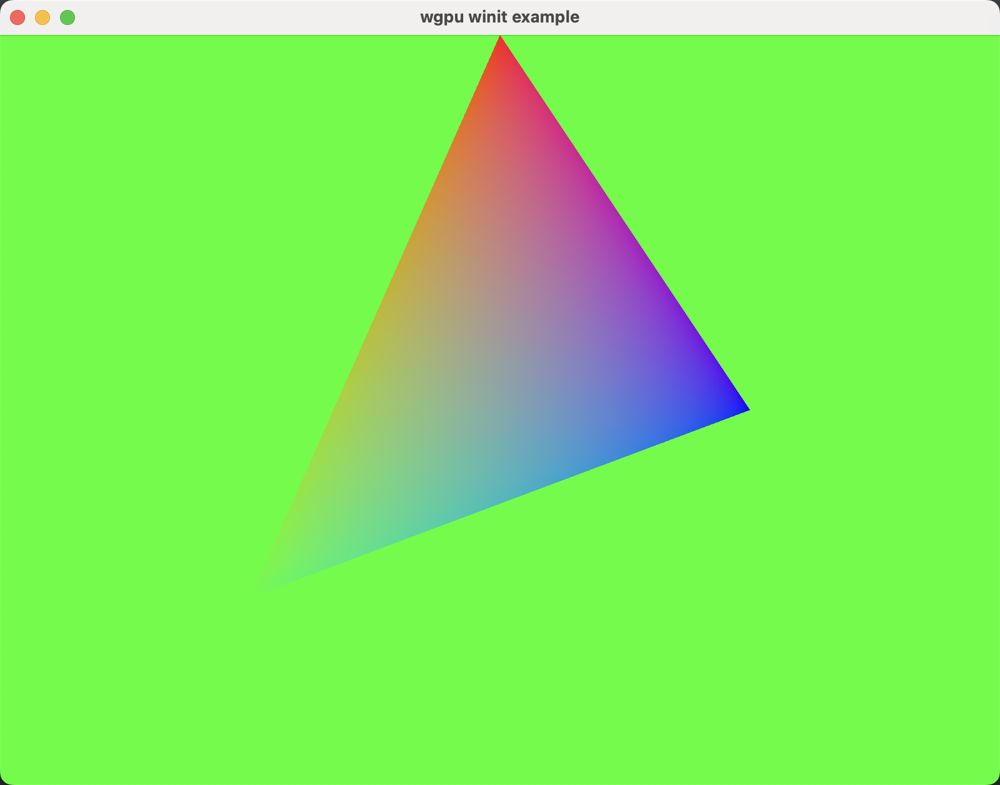

# wgpu_winit_example

WGPU示例代码，使用 wgpu 23+版本 以及 winit 0.30.0+ 版本。

WGPU code example using wgpu 23+ and winit 0.30.0+.

本项目是一个基于 winit 0.30.0+ 版本的WGPU示例项目，该项目主要适配了 winit 0.30.0+ 版本下新的代码结构体系。同时，该示例项目还可搭配本人编写的[《Wgpu图文详解》](https://zhen.blog/categories/%E6%8A%80%E6%9C%AF/Wgpu%E5%9B%BE%E6%96%87%E8%AF%A6%E8%A7%A3/)系列文章来学习。

This project is a WGPU example project based on winit 0.30.0, which is mainly adapted to the architecture of
winit 0.30.0+. At the same time, this example project can also be studied in conjunction with my series of articles titled [《Wgpu图文详解》](https://zhen.blog/categories/%E6%8A%80%E6%9C%AF/Wgpu%E5%9B%BE%E6%96%87%E8%AF%A6%E8%A7%A3/).

## Run

除了共享顶级工作区的依赖项外，每一章的代码都是可独立运行的。

Except for dependencies that share the top-level workspace, the code for each chapter is independent.

```shell
# ch02_render_a_triangle, ch03_xxx, ... whatever.
$ cargo run --package ch02_render_a_triangle
```

# screenshot



